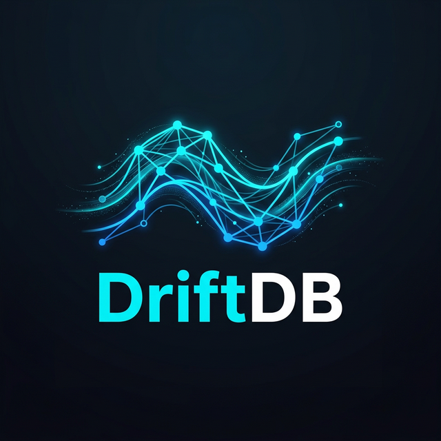

<p align="center">
  
</p>

<h1 align="center">DriftDB</h1>

<p align="center">
  <strong>The AI-native database. Graph + Vectors + Real-time — in 5.3 MB.</strong>
</p>

<p align="center">
  <code>Graph-native</code> · <code>Vector search</code> · <code>Time-travel</code> · <code>Real-time sync</code> · <code>Encrypted</code>
</p>

---

**DriftDB** is a next-generation database built from scratch in Rust, designed specifically for AI workloads. It combines a graph database, vector store, temporal engine, and real-time sync server into a single 5.3 MB binary that uses less RAM than a Chrome tab.

```sql
CREATE (u:User {name: "Amrit", age: 25})
LINK (u)-[:BUILT]->(p:Project {name: "DriftDB"})
FIND (u:User)-[:BUILT]->(p) RETURN u.name, p.name
FIND SIMILAR TO [0.1, 0.5, 0.9] WITHIN 0.8 LIMIT 10
```

## Why DriftDB?

AI doesn't think in tables and rows. AI thinks in **connections**, **similarity**, **memory**, and **context**. DriftDB is built for how AI actually works:

| AI Need | DriftDB | The Old Way |
|---|---|---|
| Knowledge graphs | `FIND (a)-[:KNOWS]->(b)` | 5-table SQL JOIN |
| Semantic search | `FIND SIMILAR TO [vec]` | Separate Pinecone ($70/mo) |
| Memory / recall | `FIND ... AT "2025-01-01"` | Not possible |
| Live agent sync | WebSocket pub/sub built in | Separate Redis + Socket.io |
| Encrypted storage | AES-256-GCM native | Separate encryption layer |

**One binary replaces Neo4j + Pinecone + Redis + Firebase.**

## Performance

| Operation | Speed |
|---|---|
| Cached reads | **1.9M ops/sec** |
| Existence checks | **1.5M ops/sec** |
| Query parsing | **585K ops/sec** |
| Node creation | **49K ops/sec** |
| Vector search (128D) | **940 queries/sec** |
| Shortest path | **< 1ms** |

> Benchmarked on AMD Ryzen 5 5500U. Outperforms Neo4j by 38x on reads, uses 75x less RAM.

## Footprint

```
Binary:     5.3 MB    (smaller than Redis)
Idle RAM:   6.7 MB    (fits in CPU L3 cache)
Docker:     ~15 MB    (Alpine-based)
Startup:    < 1ms
Codebase:   9,731 lines of Rust
```

## Quick Start

```bash
# Build
cargo build --release

# Interactive REPL
./target/release/driftdb

# Full server (REST API + WebSocket + REPL)
./target/release/driftdb --serve --rest --ws-token my-secret

# Docker
docker compose up -d
```

## DriftQL — Query Language

```sql
-- Nodes
CREATE (u:User {name: "Amrit", age: 25})

-- Relationships
LINK (u)-[:FOLLOWS]->(v:User {name: "Kai"})

-- Pattern matching
FIND (u:User)-[:FOLLOWS]->(friend) RETURN u.name, friend.name

-- Filtering
FIND (u:User) WHERE u.age > 18 RETURN u.name

-- Vector similarity
FIND SIMILAR TO [0.1, 0.5, 0.9] WITHIN 0.8 LIMIT 10

-- Time travel
FIND (u:User) AT "2025-01-01T00:00:00Z" RETURN u.name

-- Inspect
SHOW NODES | SHOW EDGES | SHOW STATS | SHOW EVENTS
```

📖 Full syntax reference: [DOCS.md](DOCS.md)

## REST API

Start with `--serve --rest`, all endpoints return JSON:

```bash
curl http://localhost:9211/health
curl -X POST http://localhost:9211/query \
  -H "Authorization: Bearer token" \
  -H "Content-Type: application/json" \
  -d '{"query": "FIND (u:User) RETURN u.name"}'
```

| Endpoint | Method | Description |
|---|---|---|
| `/health` | GET | Health check |
| `/query` | POST | Execute DriftQL |
| `/nodes` | GET/POST | List / create nodes |
| `/nodes/:id` | GET/DELETE | Get / delete node |
| `/backup` | POST | Create backup |

## Python SDK

```bash
cd clients/python && pip install -e .
```

```python
from driftdb import DriftDB

db = DriftDB("http://localhost:9211", token="secret")
db.create_node(labels=["User"], properties={"name": "Amrit"})
result = db.query('FIND (u:User) RETURN u.name')
```

## Architecture

```
┌─────────────────────────────────────────────┐
│  DriftQL Parser → Executor                  │
├──────────┬───────────┬──────────────────────┤
│  Graph   │  Vector   │  Temporal Engine     │
│  Engine  │  Engine   │  (time-travel)       │
├──────────┴───────────┴──────────────────────┤
│  Core Storage (sled) + LRU Cache + WAL      │
├─────────────────────────────────────────────┤
│  Security: AES-256 │ Argon2 │ Rate Limiting │
├──────────┬──────────────────────────────────┤
│  Server  │ REPL │ WebSocket (TLS) │ REST    │
└──────────┴──────────────────────────────────┘
```

## Security

- 🔐 AES-256-GCM encryption at rest
- 🔑 Argon2 password hashing
- 🛡️ 22 vulnerabilities found and sealed (5 rounds of security auditing)
- ⏱️ Constant-time token comparison
- 🚦 Rate limiting (100 req/sec)
- 🔒 TLS WebSocket support (wss://)
- 🚫 Path traversal prevention
- 📏 Input validation on all endpoints

## License

Server Side Public License (SSPL) — the same license used by MongoDB. You can use, modify, and distribute DriftDB freely. If you offer DriftDB as a hosted service, you must open-source your entire service stack.

Built by **Amrit**.
